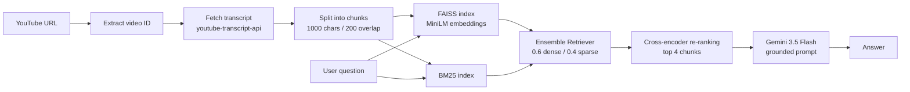

# RAG-based YouTube Chatbot

Ask questions about any YouTube video and get answers grounded **only in the video's transcript**.

The app pulls the transcript of a video, indexes it with a **hybrid retriever (semantic + keyword search)**, re-ranks the results with a **cross-encoder**, and passes the best chunks to **LLM (Cloud)** to generate the answer. If the transcript doesn't contain the answer, the bot says so instead of guessing.

---

## Features

- **Paste a link, ask a question** – simple Streamlit interface, no setup per video.
- **Hybrid retrieval** – combines FAISS (semantic/dense) and BM25 (keyword/sparse) through LangChain's `EnsembleRetriever`.
- **Cross-encoder re-ranking** – re-scores the top retrieved chunks so only the 4 most relevant reach the LLM.
- **Grounded answers** – the prompt restricts Gemini to the transcript context and returns *"I couldn't find this information in the video."* when the answer isn't there.
- **Flexible URL input** – supports `youtube.com/watch?v=...`, `youtu.be/...` links, and raw video IDs.
- **Graceful error handling** – shows a readable message if a transcript can't be fetched (e.g., captions disabled).

---

## How It Works



**Step by step**

1. **Video ID extraction** – `extract_video_id()` parses the ID from a `watch?v=` or `youtu.be/` link.
2. **Transcript fetching** – `YouTubeTranscriptApi().fetch(video_id)` retrieves the captions, which are joined into one text.
3. **Chunking** – `RecursiveCharacterTextSplitter` splits the text into chunks of 1000 characters with 200 characters of overlap.
4. **Indexing** – chunks are embedded with `sentence-transformers/all-MiniLM-L6-v2` and stored in an in-memory **FAISS** index; a **BM25** index is built over the same chunks.
5. **Hybrid retrieval** – each retriever returns its top 15 chunks, merged by `EnsembleRetriever` with weights `0.6` (FAISS) and `0.4` (BM25).
6. **Re-ranking** – `cross-encoder/ms-marco-MiniLM-L-6-v2` scores each (question, chunk) pair and keeps the top 4.
7. **Generation** – the selected chunks are formatted into a prompt and sent to Gemini (`temperature=0.2`) through a LangChain chain: `prompt | llm | StrOutputParser`.

---

## Tech Stack

| Layer | Tools |
|---|---|
| UI | Streamlit |
| Orchestration | LangChain (`langchain`, `langchain-core`, `langchain-community`, `langchain-classic`, `langchain-text-splitters`) |
| Transcript | `youtube-transcript-api` |
| Embeddings | Hugging Face `all-MiniLM-L6-v2` via `langchain-huggingface` / `sentence-transformers` |
| Vector store | FAISS (`faiss-cpu`) |
| Keyword search | BM25 (`rank_bm25`) |
| Re-ranker | `cross-encoder/ms-marco-MiniLM-L-6-v2` |
| LLM | Google Gemini via `langchain-google-genai` |
| Config | `python-dotenv` |

---

## Project Structure

```
RAG-based-YouTube-Chatbot/
├── app.py             # Streamlit front end
├── rag.py             # RAG pipeline (transcript → retrieval → re-rank → LLM)
├── requirements.txt   # Python dependencies
└── .env               # Your API key (not committed)
```

- **`app.py`** – takes the YouTube URL and question, calls `get_answer()`, and displays the result with a loading spinner.
- **`rag.py`** – contains the full pipeline. `get_answer(youtube_url, question)` is the single entry point used by the UI. Running `python rag.py` executes a quick test on a sample video.

---

## Getting Started

### Prerequisites

- Python 3.10+
- A [Google AI Studio](https://aistudio.google.com/) API key for Gemini

### Installation

```bash
# 1. Clone the repository
git clone https://github.com/spycoder01/RAG-based-YouTube-Chatbot.git
cd RAG-based-YouTube-Chatbot

# 2. Create and activate a virtual environment
python -m venv venv
source venv/bin/activate        # Windows: venv\Scripts\activate

# 3. Install dependencies
pip install -r requirements.txt
```

### Configure the API key

Create a `.env` file in the project root:

```env
GOOGLE_API_KEY=your_google_api_key_here
```

The app raises an error at startup if `GOOGLE_API_KEY` is missing.

### Run the app

```bash
streamlit run app.py
```

Then open the local URL shown in the terminal (usually `http://localhost:8501`).

### Quick test from the terminal (optional)

```bash
python rag.py
```

This runs the pipeline on a sample video with the question *"What is self attention?"* and prints the answer.

> **Note:** The first run downloads the embedding and cross-encoder models from Hugging Face, so it may take a little longer.

---

## Usage

1. Paste a YouTube URL (e.g. `https://www.youtube.com/watch?v=kCc8FmEb1nY`).
2. Type your question about the video.
3. Click **Generate Answer**.

Example questions: *"What is self attention?"*, *"What examples does the speaker give?"*, *"Summarize the main argument."*

---

## Configuration

You can tune the pipeline by editing the values in `rag.py`:

| Parameter | Default | Description |
|---|---|---|
| `chunk_size` | `1000` | Characters per transcript chunk |
| `chunk_overlap` | `200` | Overlap between consecutive chunks |
| FAISS `k` | `15` | Candidates from semantic search |
| BM25 `k` | `15` | Candidates from keyword search |
| Ensemble `weights` | `[0.6, 0.4]` | Weight of FAISS vs. BM25 |
| Re-ranker `top_k` | `4` | Chunks passed to the LLM after re-ranking |
| LLM `temperature` | `0.2` | Lower = more deterministic answers |

---

## Limitations

- Works only for videos that have a **transcript/captions available**.
- The transcript is fetched and indexed **on every question**, so repeated questions on the same video are slower than necessary (no caching yet).
- Answers are limited to what is spoken in the video; visual-only content isn't captured.
- URL parsing covers `watch?v=` and `youtu.be/` formats; other formats (e.g. Shorts, embed links) may need to be converted to a standard link.
- Some networks or cloud IPs may be blocked by YouTube when fetching transcripts.

---

## Future Improvements

- Cache the transcript, FAISS index, and models per video (e.g. with `st.cache_resource`) to speed up follow-up questions.
- Add chat history / multi-turn conversation.
- Show source chunks (with timestamps) alongside each answer.
- Support more URL formats and multilingual transcripts.
- Deploy the app (Streamlit Community Cloud / Hugging Face Spaces).

---

## Acknowledgements

[LangChain](https://www.langchain.com/) · [Streamlit](https://streamlit.io/) · [FAISS](https://github.com/facebookresearch/faiss) · [Sentence-Transformers](https://www.sbert.net/) · [Google Gemini](https://ai.google.dev/) · [youtube-transcript-api](https://github.com/jdepoix/youtube-transcript-api)

---

**Author:**

**Abhisek Gupta**, [@spycoder01](https://github.com/spycoder01)
